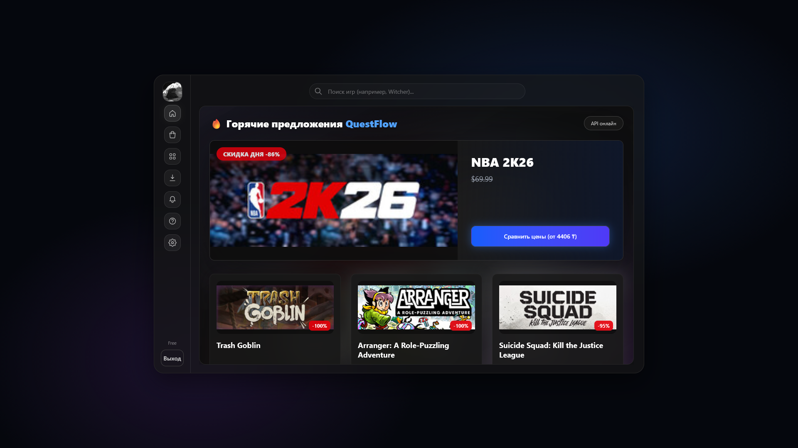
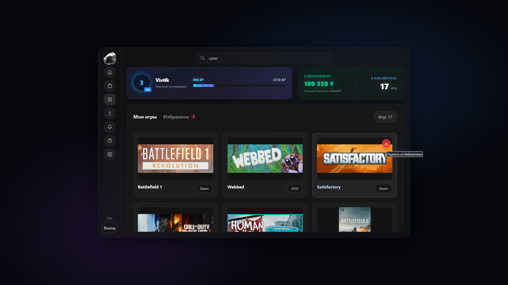
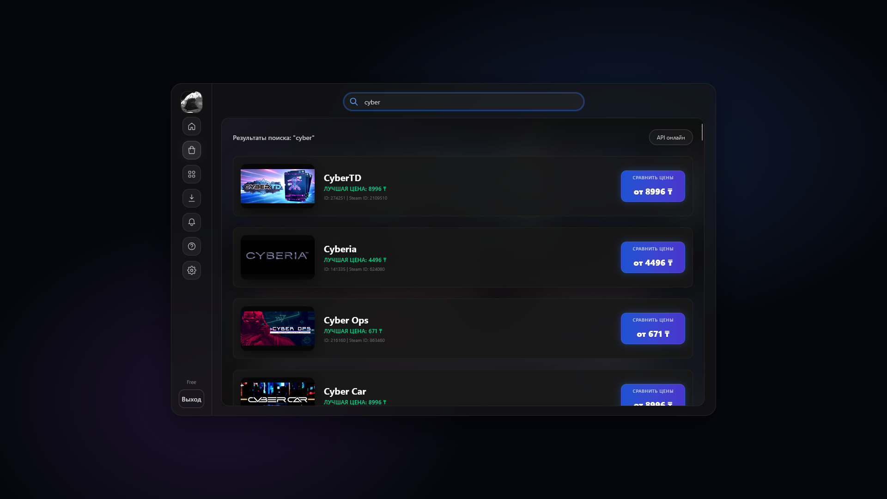
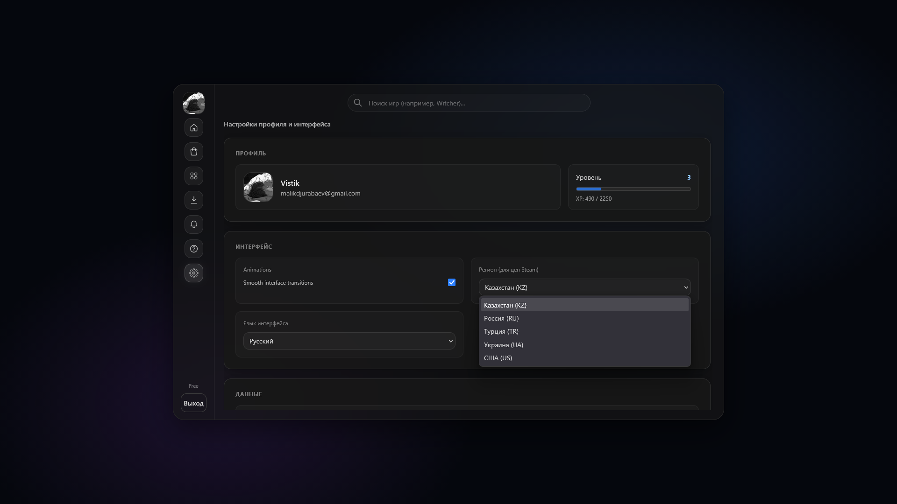
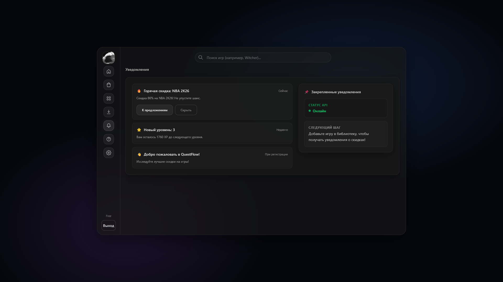
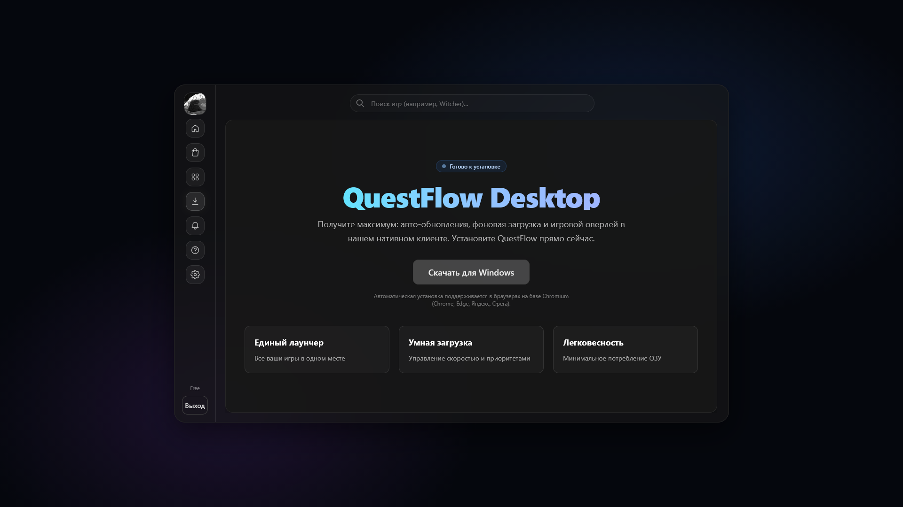
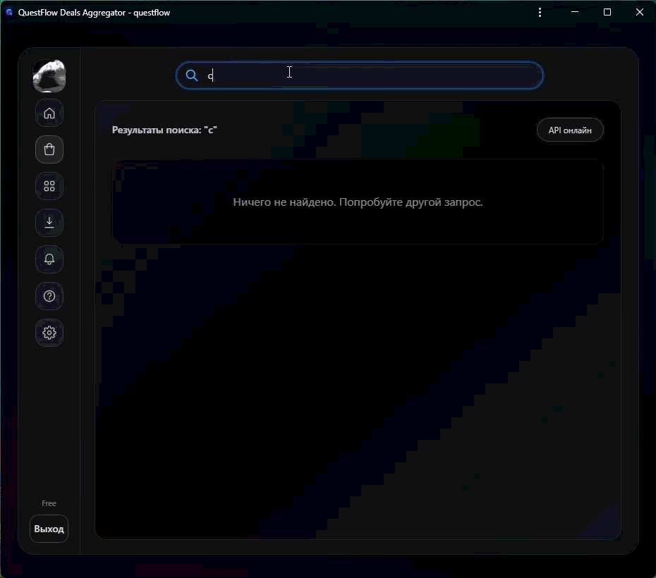

# 🎮 QuestFlow

[🇬🇧 English](README.md) · [Старый README](README.ru.old.md)

> **Единая игровая платформа для поиска игр, сравнения цен и скидок, управления библиотекой и дальнейшего объединения разных игровых сервисов в одном интерфейсе.**

## О проекте

**QuestFlow** - учебный и портфолио-проект, который развивается от агрегатора игровых предложений в сторону полноценной единой игровой платформы.

Главная идея - убрать необходимость постоянно переключаться между разными магазинами и лаунчерами. Пользователь должен иметь одно место, где можно найти игру, сравнить предложения, добавить ее в библиотеку или список желаемого, отслеживать скидки и в дальнейшем запускать установленные игры.

Сейчас проект существует как веб-приложение. В дальнейшем QuestFlow планируется развивать и как desktop-клиент уровня игрового лаунчера.

## Что уже реализовано

- каталог игр и просмотр предложений;
- поиск и страницы отдельных игр;
- пользовательская библиотека;
- список желаемого;
- система XP, уровней и прогресса;
- авторизация через Firebase;
- облачная синхронизация пользовательских данных;
- гостевой режим;
- региональные валюты и обновление курсов;
- русский, английский и казахский языки;
- уведомления и проверка списка желаемого;
- PWA-установка;
- Telegram-интеграция и автоматическая проверка скидок;
- адаптивный интерфейс в стиле glassmorphism;
- настройки языка, региона и анимаций;
- обработка ошибок, состояния загрузки и защищенные маршруты.

## Во что должен вырасти QuestFlow

Моя цель - сделать QuestFlow не просто агрегатором скидок, а единым игровым клиентом.

В план развития входят:

- единая библиотека Steam, Epic Games, GOG и локально установленных игр;
- автоматическое обнаружение библиотек и manifest-файлов;
- запуск игр и программ непосредственно через QuestFlow;
- установка и удаление игр;
- управление загрузками;
- выбор папок установки;
- сканирование библиотек;
- проверка файлов;
- отслеживание запущенных процессов и времени в игре;
- история запусков;
- достижения и расширенная статистика профиля;
- история цен;
- более полное сравнение предложений разных магазинов;
- обнаружение одной и той же игры в нескольких библиотеках без дубликатов;
- персональные рекомендации;
- объяснение, почему система рекомендует конкретную игру;
- учет жанров, предпочтений, цены, скидки и технической совместимости;
- фильтры и возможность исключать нежелательные жанры или игры;
- синхронизация между устройствами;
- desktop-версия на Electron;
- локальная база данных и работа библиотеки без интернета;
- развитие дизайна Liquid Glass;
- динамические фоны, более глубокие анимации и 3D-элементы интерфейса.

Эти функции относятся к **roadmap** и не обозначаются как готовые, пока они реально не реализованы в коде.

## Основные экраны

### Главная и библиотека

| Главная | Библиотека |
| :---: | :---: |
|  |  |

### Поиск и настройки

| Поиск | Настройки |
| :---: | :---: |
|  |  |

### Уведомления и установка

| Уведомления | PWA / Загрузки |
| :---: | :---: |
|  |  |

### Демонстрация поиска



## Технологии текущей версии

- React 19
- TypeScript
- Vite
- React Router
- Zustand
- TanStack Query
- Firebase Authentication
- Firestore
- Tailwind CSS 4 и собственные стили интерфейса
- i18next
- React Hook Form
- Zod
- Vitest
- PWA
- GitHub Actions

## Направление архитектуры

Текущая версия построена как React-приложение с Firebase и внешними API.

По мере развития проекта отдельные задачи планируется выносить в самостоятельные части системы: агрегацию данных игровых магазинов, обработку цен, интеллектуальные рекомендации, desktop-логику и локальную библиотеку. Это позволит развивать QuestFlow как полноценную информационную систему, а не только как интерфейс каталога.

## Запуск проекта

```bash
git clone https://github.com/GalaxyEmerald2019/---QuestFlow.git
cd ---QuestFlow
npm install
cp .env.example .env
npm run dev
```

Сборка:

```bash
npm run build
```

Тесты:

```bash
npm run test:run
```

## Статус

**QuestFlow находится в активной разработке.**

Текущий репозиторий содержит рабочую веб-версию и основу для дальнейшего развития единой игровой платформы и desktop-клиента.

## Старые README

Предыдущие README с описанием VELO сохранены отдельно и не удалены:

- [README.old.md](README.old.md)
- [README.ru.old.md](README.ru.old.md)
